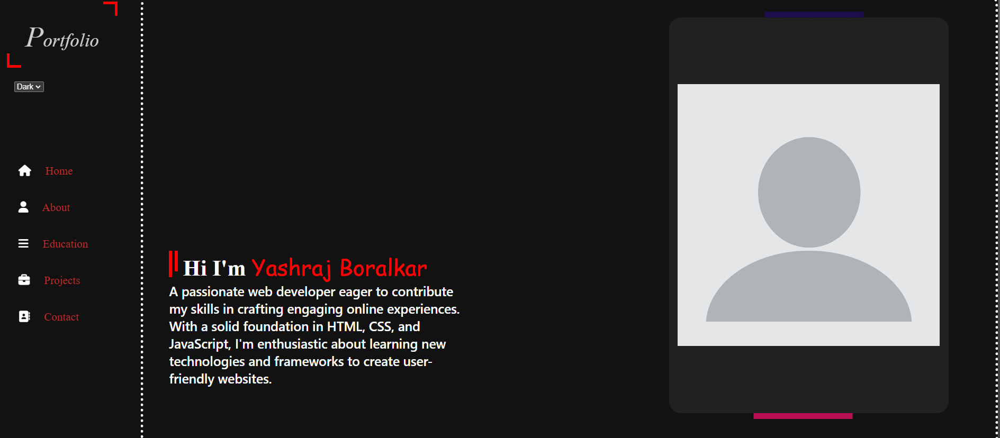

# Portfolio Site



## Table of Contents
- [Introduction](#introduction)
- [Features](#features)
- [Technologies Used](#technologies-used)
- [Setup](#setup)
- [Usage](#usage)
- [Contributing](#contributing)
- [License](#license)
- [Contact](#contact)

## Introduction
This repository contains the code for my personal portfolio website. It showcases my projects, skills, and experience in web development and design.

## Features
- Responsive design for optimal viewing across various devices.
- Projects section with detailed project descriptions and links.
- Skills section highlighting technical skills and competencies.
- Contact form for inquiries and feedback.

## Technologies Used
- **HTML**: Markup language used for structuring the content.
- **CSS**: Stylesheets used for styling the visual aspects of the site.
- **JavaScript**: Adds interactivity and dynamic functionality to the site.

## Setup
To run this project locally, follow these steps:

1. **Clone the repository:**
   ```bash
   git clone [https://github.com/your-username/portfolio.git](https://github.com/Ysb321/portfolio/)

